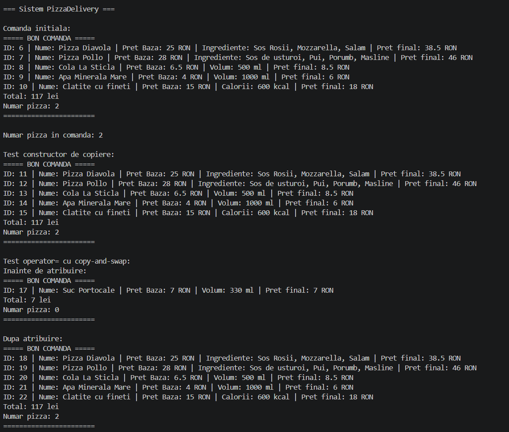
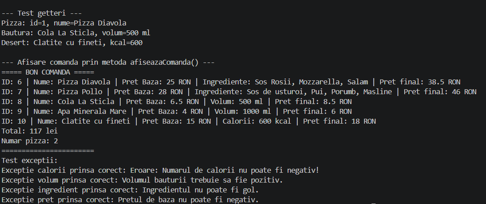

# Proiect POO - Pizza Delivery

## Enunț

Să se implementeze o aplicație pentru gestionarea comenzilor unui restaurant de tip pizza delivery. O comandă poate conține mai multe tipuri de produse: pizza, băuturi și deserturi. Fiecare produs are un nume, un preț de bază și un id generat automat, iar fiecare tip de produs are propriul mod de calcul al prețului final.

Pizza are o listă de ingrediente, băutura are un volum, iar desertul are un număr de calorii. Programul trebuie să permită adăugarea produselor într-o comandă, afișarea bonului, calcularea totalului și numărarea produselor de tip pizza. Datele invalide, precum preț negativ, ingredient gol, volum invalid sau număr invalid de calorii, sunt tratate prin excepții proprii.

## Rezolvare

Pentru rezolvare am folosit o ierarhie de clase cu baza `Produs`, clasă abstractă ce conține informațiile comune tuturor produselor. Din aceasta derivă clasele `Pizza`, `Bautura` și `Desert`, fiecare implementând metodele virtuale pure `calculeazaPret()` și `clone()`. Metoda `clone()` este folosită pentru copiere polimorfică, deoarece produsele sunt gestionate prin pointeri la clasa de bază.

Clasa `Comanda` conține un `std::vector<Produs*>`, ceea ce permite stocarea mai multor tipuri de produse în aceeași colecție. La adăugarea sau copierea produselor se folosește `clone()`, iar memoria este eliberată în destructor. Pentru copiere corectă au fost implementate constructorul de copiere și operatorul de atribuire folosind copy-and-swap.

Pentru afișare am folosit operatorul `<<`, împreună cu o funcție virtuală de afișare în clasele derivate. Funcția `numaraPizza()` folosește `dynamic_cast` pentru a verifica dacă un produs din comandă este de tip `Pizza`. Validările sunt realizate prin excepții definite în `Exceptii.hpp`, iar în `main.cpp` sunt testate funcționalitățile principale ale proiectului.

## Cateva din concepte POO folosite 

- moștenire și clasă abstractă;
- funcții virtuale și funcții virtuale pure;
- polimorfism prin pointeri la clasa de bază;
- destructor virtual;
- copiere polimorfică prin `clone()`;
- compunere între `Comanda` și `Produs`;
- constructor de copiere, operator de atribuire și copy-and-swap;
- supraîncărcarea operatorilor `<<` și `>>`;
- excepții proprii;
- membri statici pentru generarea id-urilor.

## Exemplu de rulare

Mai jos este un output-ul programului:

*Continuare:*

